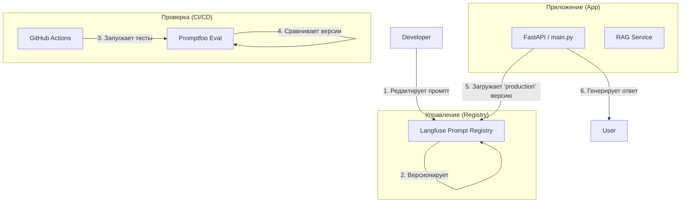

# 🕵️‍♂️ Meeting Data Extractor (LLMOps Prompt Layer)

Система управления промптами, обеспечивающая независимость инструкций от программного кода, версионирование через Langfuse и автоматическое тестирование через Promptfoo.

## 🎯 Цель проекта
Разделение логики приложения и конфигурации LLM-промптов. Это позволяет обновлять инструкции для ИИ «на лету» без пересборки кода и гарантировать их качество с помощью автоматических тестов.

## 🏗 Архитектура системы



## 🧱 Основные компоненты

1.  **Langfuse Prompt Registry**: Централизованное хранилище промптов. Поддерживает теги (`production`, `staging`) и версионность.
2.  **Promptfoo**: Инструмент для оценки промптов (Eval). Позволяет сравнивать разные версии промптов на наборе тестовых примеров.
3.  **Dynamic Loading**: Приложение подхватывает изменения промпта из облака мгновенно, ориентируясь на тег `production`.
4.  **CI/CD Pipeline**: Автоматический запуск тестов при каждом изменении кода или промпта.

## 🚀 Быстрый старт

### 1. Установка окружения
```bash
python -m venv venv
source venv/bin/activate  # или .\venv\Scripts\activate на Windows
pip install -r requirements.txt
```

### 2. Настройка переменных окружения
Создайте файл `.env` на основе `.env.example`:
```env
MISTRAL_API_KEY=...
LANGFUSE_PUBLIC_KEY=...
LANGFUSE_SECRET_KEY=...
LANGFUSE_HOST=...
```

### 3. Выгрузка промптов в Langfuse
```bash
python upload_prompts.py
```

### 4. Запуск тестирования (Promptfoo)
```bash
npx promptfoo eval
```

## 📂 Структура проекта

- `main.py` — FastAPI сервис с динамической загрузкой промптов.
- `upload_prompts.py` — Скрипт для первичной миграции промптов в registry.
- `deploy_prompts.py` — Скрипт для автоматического переключения тегов в CI/CD.
- `promptfooconfig.yaml` — Конфигурация тестов и провайдеров (Mistral/OpenAI).
- `.github/workflows/prompt_eval.yml` — Описание пайплайна для GitHub Actions.

## 🛠 CI/CD и безопасность
Пайплайн настроен так, что промпт получит статус `production` только в случае, если все тесты в `promptfoo` пройдены успешно (100% PASS). Это гарантирует, что изменения не привели к регрессии или галлюцинациям.
